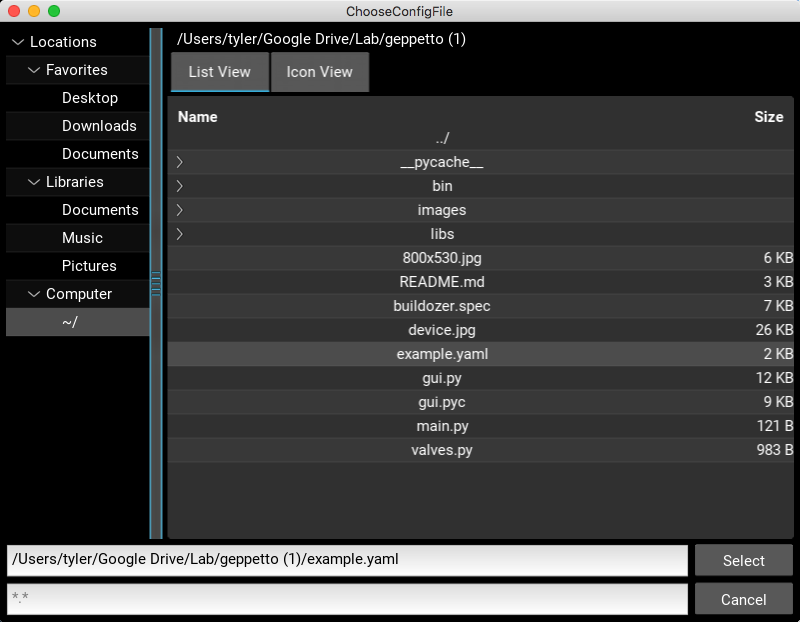

# Geppetto Microfluidic Pneumatic Controller

Geppetto is a pure-python pneumatic control software based on the [Kivy graphical user interface framework](https://kivy.org/). The GUI is built to support nearly any user-defined control layout, with the ability to change the background image and the placement of the control buttons through the manipulation of simple [YAML](http://www.yaml.org) config file.

A Windows binary is available [**here**](https://github.com/FordyceLab/geppetto/releases/download/v1.0/Geppetto.exe).

## Writing and opening a config file

To begin, you will need to open up a YAML config file that specifies the mapping of the control valves to buttons and the IP address of the Wago controller. An example config file is given the code block below:

```yaml
ip_address: 192.168.1.3
device_image: "/Users/tyler/device.jpg"
valves:
    Line 1:
        valve_number: 0
        initial_state: False
        x_pos: 120
        y_pos: 10
    Line 2:
        valve_number: 1
        initial_state: False
        x_pos: 60
        y_pos: 365
```

- The first line of this example specifies the IP address of the Wago controller.
- The second line specifies the background image to use. This can be an image of the device you wish to control or some image that will help you keep track of which buttons control which valves.
    - The image must be 800 px wide by 530 px high in order to properly fit the GUI.
    - It is best to specify the image using the [absolute path rather than the relative path](http://www.linuxnix.com/abslute-path-vs-relative-path-in-linuxunix/).
    - If no image is specified, a white background will be generated.
- The third line begins the dictionary of valve listings.
    - For each valve:
        - The first line contains the valve name as it will appear in the GUI.
        - The first indented line contains the valve number mapping. Valve numbers are 0-indexed.
        - The second indented line contains the initial state of the valve: `True` maps to pressurized while `False` maps to depressurized.
        - The third indented line contains the x position for the center of the box containing the button controlling the valve.
        - The fourth indented line contains the y position for the center of the box containing the button controlling the valve.

To get the x and y positions for the buttons, I suggest using a program like ImageJ to open your background image, then hovering above and recording the position you would like place the button. ImageJ will give coordinates from the upper left corner of the image, while Geppetto takes coordinates from the lower left corner. To convert between the two formats, you will simply need to subtract the y-coordinate from 530 and enter that into the config file. The x-coordinate from ImageJ will work directly with Geppetto.

Once you have completed the config file, you can run the Geppetto program. Use the file selection dialog box to select your desired config file as shown below.



## The interface and controlling valves

The Geppetto interface consists of four master control buttons as well individual controls for each valve. The roles of the master control buttons are outlined below:

- `Initialize Valve States` - Set all of the valves to the state specified in the config file  `initial_state` variable.
- `Read Valve States` - Read the current state of all valves and update GUI accordingly. This functionality is useful in the case of program/computer crash and restart.
- `Pressurize All` - Pressurize all of the valves.
- `Depressurize All` - Depressurize all of the valves.


 When the program initially starts, the states of the valves are unknown to it. You can use the `Read Valve States` button to set the coloration and labeling to the current state of all valves, or one of the other 3 buttons to establish a state for each valve. From this point, the valves can be controlled individually using the buttons, each time a button is depressed, the color (red = depressurized, blue = pressurized) and label (D = depressurized, P = pressurized) will update. 
